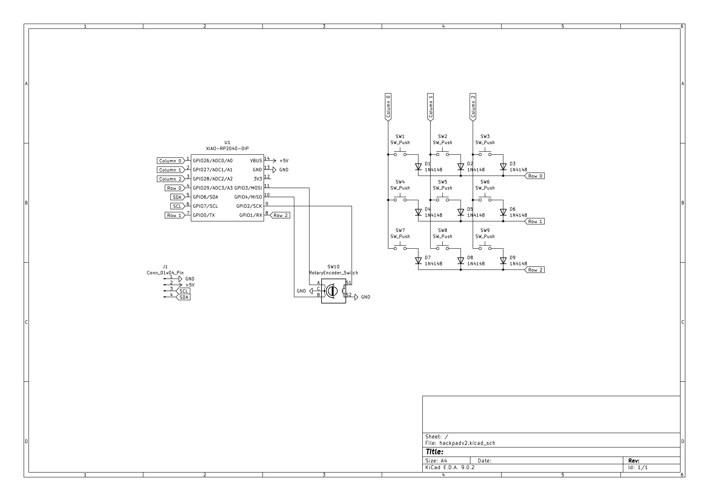
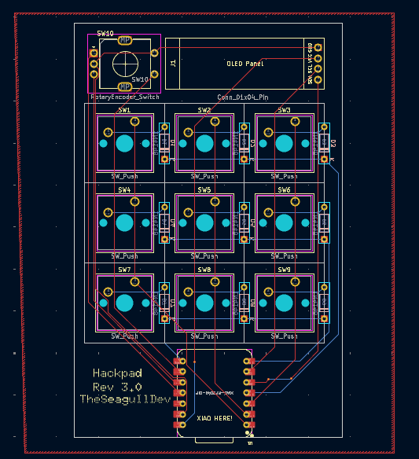
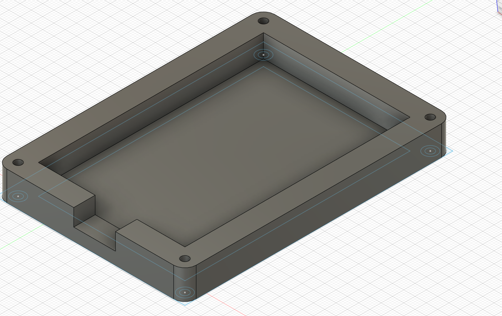
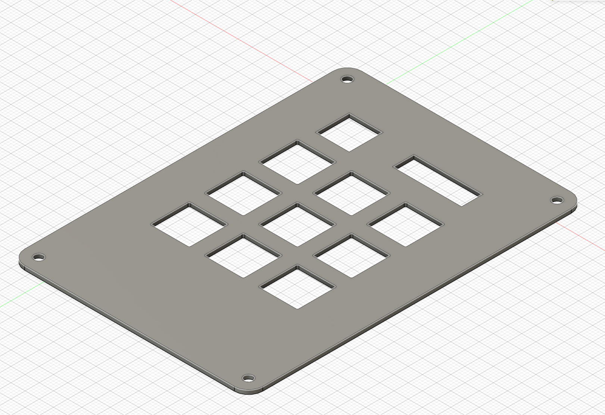

# theseagulldevs-ultimate-hackpad

A cool 3x3 macropad I made with an OLED and encoder. I'm going to try to use it as a controller for QLAB and maybe also as a general purpose macropad

## Features
- Currently being used as QLAB controller, a software that controlls SFX for live theatre
- Has buttons for GO, Panic, Pause, Resume, Audition, Next/Last Cue, and Open/Close group cues
- Encoder is bound to volume and can be pressed to mute

## Assembled Hackpad

## Schematic

## PCB

## Case

## BOM

- 1x PCB
- 1x Seeed XIAO RP2040 Microcontroller
- 9x Cherry MX Switches
- 9x Through-hole 1N4148 Diodes
- 1x EC11 Encoder with switch
- 1x 0.91 in OLED display
- 9x DSA keycaps
- 1x 3D printed case (To be printed myself)
- Mounting hardware

